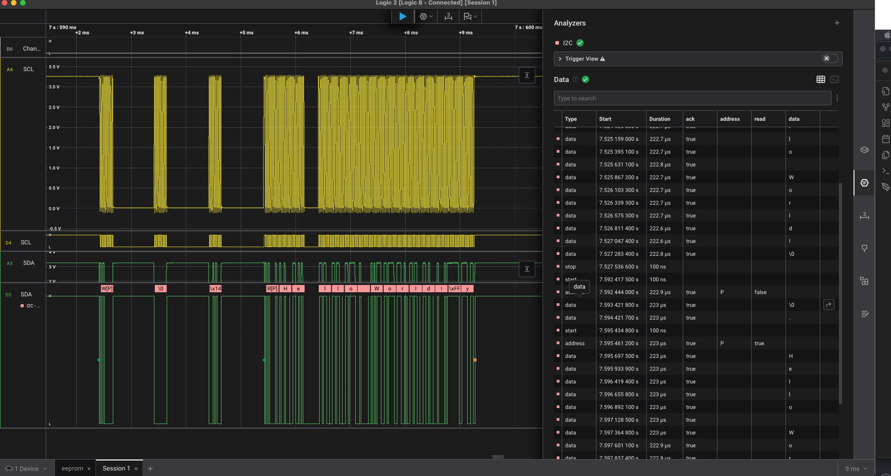
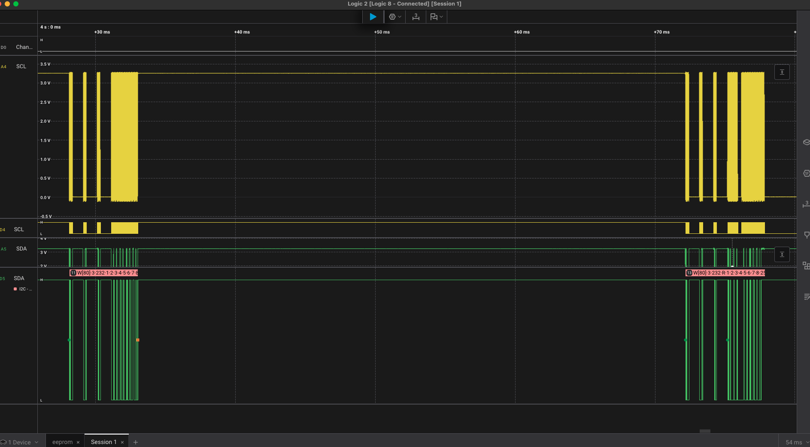

# 24LC32 EEPROM Driver API 

This repository is an I2C-based driver API written for the 24LC32 EEPROM chip in bare-metal C. The API allows for read and write memory manipulation of the chip in singular and multiple bytes. The data types compatible with this driver are unsigned integers, signed integers, and characters (for strings).

# How to Set Up and Use

To set up and use this API, the user needs to clone the repository into their workspace and ensure that they include "i2c/i2c.h" in their working code. 

Before calling any API code, please ensure that the "eeprom_i2c_init" function is called to initialize the EEPROM. 

# Logic Analyzer I2C Communication Screenshots

eeprom_read_string Call Visualized

eeprom_write_pages_uint() and eeprom_read_uint() call 

# Functions

**NOTE**: For read and writes of multiple bytes, the registers are sequential. For example, reading register 0x01 with a read size of 3 will read registers 0x01, 0x02, and 0x03.
 
**uint8_t eeprom_read_byte_uint(uint16_t)**: Read an unsigned integer byte from specified address

**void eeprom_read_uint(uint16_t, uint8_t\*, size_t)**: Read a series of unsigned integer bytes from a specified address, read size must be declared.

**void eeprom_write_byte_uint(uint16_t, uint8_t)**: Write an unsigned integer byte to specified address

**void eeprom_write_pages_uint(uint16_t, uint8_t\*, size_t)**: Write a series of unsigned integer bytes to specified address, write size must be declared

**int8_t eeprom_read_byte_int(uint16_t)**: Read a signed integer byte from specified address

**void eeprom_read_int(uint16_t, int8_t\*, size_t)**: Read a series of signed integer bytes from specified address, read size must be declared

**void eeprom_write_byte_int(uint16_t, int8_t)**: Write a signed integer byte to specified address

**void eeprom_write_pages_int(uint16_t, int8_t\*, size_t)**: Write a series of signed integer bytes to specified address, write size must be declared

**char eeprom_read_byte_char(uint16_t)**: Read a character byte from specified address

**void eeprom_read_string(uint16_t, char\*, size_t)**: Read a series of characters from specified address (to form a string), read size must be declared

**void eeprom_write_byte_char(uint16_t, char)**: Write a character to a specified address

**void eeprom_write_string(uint16_t, char\*, size_t)**: Write a series of characters to specified address (to store a string), write size must be declared

# Links

EEPROM that I Used (Adafruit 24LC32 I2C EEPROM Breakout):

https://www.adafruit.com/product/5146?srsltid=AfmBOopn22i99GCbMi_croweaxJnrLV9Tkmn4vLK9AH3g4qLe5_JayR2

24LC32 Technical Reference Manual

https://ww1.microchip.com/downloads/en/DeviceDoc/21072G.pdf
